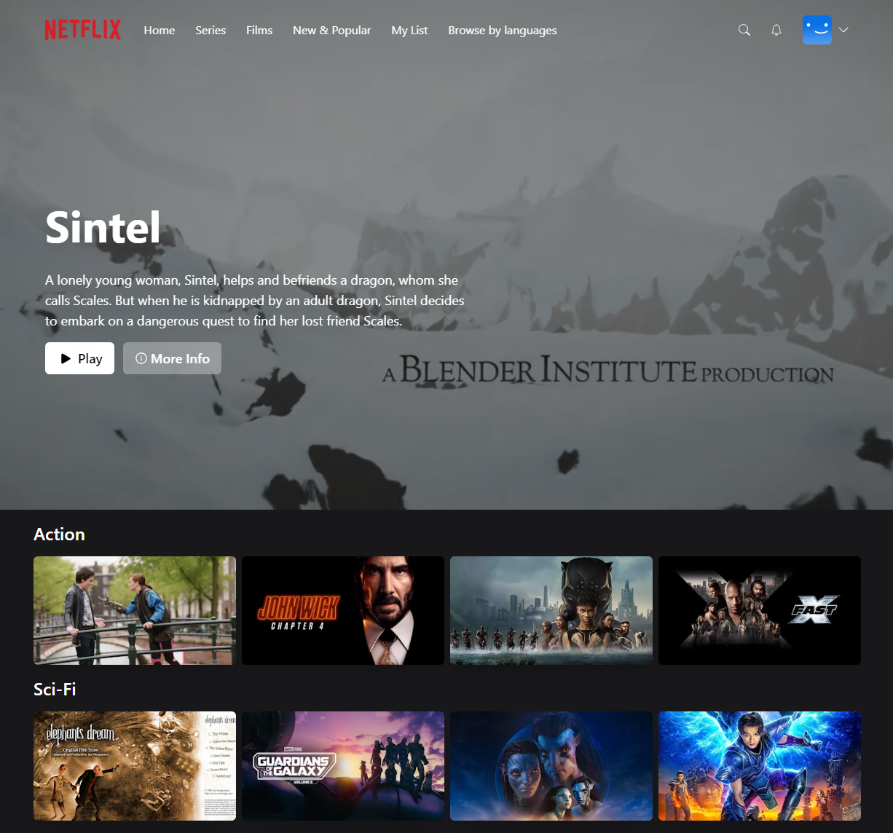

<div align='center'>

  [![demo][demo]][demo-link]
  [![status][status]][status-link]
  [![deploy][deploy]](/)
  [![test][tests]][tests-link]

</div>

<div align='center'>
  <a href='/'>
    
  </a>
</div>

<div align='center'>
  <h1>Netflix App with Next</h1>
</div>

<div align='center'>

  [![Next.js][nextjs]][nextjs-link]
  [![TypeScript][typescript]][typescript-link]
  [![Tailwind CSS][tailwindcss]][tailwindcss-link]
  [![React][react]][react-link]
  [![Lodash][lodash]][lodash-link]
  [![Next-Auth][next-auth]][next-auth-link]
  [![Prisma][prisma]][prisma-link]
  [![Axios][axios]][axios-link]
  [![React-Icons][react-icons]][react-icons-link]
  [![SWR][swr]][swr-link]
  [![Zustand][zustand]][zustand-link]
  [![React-Player][react-player]][react-player-link]
  [![MongoDB][mongodb]][mongodb-link]
  [![Vercel][vercel]][vercel-link]

</div>

<div align='center'>
  App inspired by Netflix, built with Next.js, TypeScript, Tailwind CSS, Next-Auth, Prisma, and MongoDB. Browse a list of movies, add movies to favorites, play movies, and more.

  [Demo]({{DEMO_URL}}) · [Report issue](/issues) · [Suggest something](/issues)
</div>

## Table of Contents

- [Table of Contents](#table-of-contents)
- [Features](#features)
- [Tech Stack](#tech-stack)
- [Getting Started](#getting-started)
  - [Prerequisites](#prerequisites)
  - [Installation](#installation)
  - [Running locally](#running-locally)
  - [Build](#build)
- [Environment Variables](#environment-variables)
- [Project Structure](#project-structure)
- [Demo](#demo)
- [API Reference](#api-reference)
- [Contributing](#contributing)
- [License](#license)

## Features

- [x] Authentication with Next-Auth (JWT strategy)
- [x] GitHub and Google OAuth login
- [x] Credentials-based email/password login and registration
- [x] Guest account access for quick demo
- [x] Show list of movies grouped by genre (Action, Sci-Fi, Other)
- [x] Add and remove movies from favorites
- [x] Movie info modal with details
- [x] Play movies with React Player
- [x] Random billboard movie on homepage
- [x] User profiles page
- [x] Responsive design with Tailwind CSS
- [x] Dynamic navbar with scroll effect
- [x] Mobile menu navigation
- [x] Loading overlay animations
- [x] Database with Prisma and MongoDB
- [x] State management with Zustand
- [x] SWR for data fetching and caching
- [x] Deployed on Vercel

## Tech Stack

- [Next.js 13](https://nextjs.org/)
- [TypeScript](https://www.typescriptlang.org/)
- [Tailwind CSS](https://tailwindcss.com/)
- [React 18](https://react.dev/)
- [Next-Auth](https://next-auth.js.org/)
- [Prisma](https://www.prisma.io/)
- [MongoDB](https://www.mongodb.com/)
- [Axios](https://axios-http.com/)
- [SWR](https://swr.vercel.app/)
- [Zustand](https://zustand-demo.pmnd.rs/)
- [React Player](https://www.npmjs.com/package/react-player)
- [React Icons](https://react-icons.github.io/react-icons/)
- [Lodash](https://lodash.com/)
- [Bcrypt](https://www.npmjs.com/package/bcrypt)
- [Vercel](https://vercel.com/)

## Getting Started

### Prerequisites

- Node.js 18+
- npm or yarn
- A MongoDB Atlas account (for database)
- GitHub OAuth credentials (for GitHub login)
- Google OAuth credentials (for Google login)

### Installation

```bash
git clone https://github.com/wrujel/netflix-clone.git
cd netflix-clone
npm install
```

### Running locally

```bash
npm run dev
```

Open [http://localhost:3000](http://localhost:3000) with your browser to see the result.

### Build

```bash
npm run build
```

## Environment Variables

To run this project, you will need to add the following environment variables to your `.env` file.

| Variable               | Description                               | Required |
| :--------------------- | :---------------------------------------- | :------: |
| `DATABASE_URL`         | MongoDB connection string                 |   Yes    |
| `NEXTAUTH_SECRET`      | Secret for NextAuth.js session encryption |   Yes    |
| `NEXTAUTH_JWT_SECRET`  | Secret for NextAuth.js JWT token signing  |   Yes    |
| `GITHUB_CLIENT_ID`     | GitHub OAuth app client ID                |   Yes    |
| `GITHUB_CLIENT_SECRET` | GitHub OAuth app client secret            |   Yes    |
| `GOOGLE_CLIENT_ID`     | Google OAuth client ID                    |   Yes    |
| `GOOGLE_CLIENT_SECRET` | Google OAuth client secret                |   Yes    |
| `GUEST_EMAIL`          | Email for the shared guest account        |    No    |

## Project Structure

```
/
├── components/
│   ├── AccountMenu.tsx
│   ├── Billboard.tsx
│   ├── FavoriteButton.tsx
│   ├── InfoModal.tsx
│   ├── Loading.tsx
│   ├── MovieCard.tsx
│   ├── MovieList.tsx
│   ├── Navbar.tsx
│   └── ...
├── hooks/
│   ├── useBillboard.ts
│   ├── useCurrentUser.ts
│   ├── useFavorites.ts
│   ├── useInfoModal.ts
│   ├── useMovie.ts
│   └── useMovies.ts
├── libs/
│   ├── fetcher.ts
│   ├── prismadb.ts
│   └── serverAuth.ts
├── pages/
│   ├── api/
│   │   ├── auth/
│   │   │   └── [...nextauth].ts
│   │   ├── movies/
│   │   │   ├── index.ts
│   │   │   └── [movieId].ts
│   │   ├── current.ts
│   │   ├── favorite.ts
│   │   ├── favorites.ts
│   │   ├── guest.ts
│   │   ├── random.ts
│   │   └── register.ts
│   ├── watch/
│   │   └── [movieId].tsx
│   ├── _app.tsx
│   ├── auth.tsx
│   ├── index.tsx
│   └── profiles.tsx
├── prisma/
│   └── schema.prisma
├── public/
│   └── images/
├── styles/
│   └── globals.css
├── package.json
├── tailwind.config.js
├── tsconfig.json
└── next.config.js
```

## Demo

You can check out the demo:

[![Demo][demo]][demo-link]

## API Reference

| Method  | Endpoint          | Description                         | Auth Required |
| :------ | :---------------- | :---------------------------------- | :-----------: |
| `POST`  | `/api/register`   | Register a new user                 |      No       |
| `POST`  | `/api/guest`      | Get guest account credentials       |      No       |
| `GET`   | `/api/current`    | Get current authenticated user      |      Yes      |
| `GET`   | `/api/movies`     | List all movies                     |      Yes      |
| `GET`   | `/api/movies/:id` | Get movie by ID                     |      Yes      |
| `GET`   | `/api/random`     | Get a random billboard movie        |      Yes      |
| `POST`  | `/api/favorite`   | Add a movie to favorites            |      Yes      |
| `PATCH` | `/api/favorite`   | Remove a movie from favorites       |      Yes      |
| `GET`   | `/api/favorites`  | List current user's favorite movies |      Yes      |

## Contributing

Contributions are welcome! If you have suggestions or find bugs, please open an issue or submit a pull request.

1. Fork the repository
2. Create your feature branch (`git checkout -b feature/amazing-feature`)
3. Commit your changes (`git commit -m 'Add some amazing feature'`)
4. Push to the branch (`git push origin feature/amazing-feature`)
5. Open a Pull Request

## License

This project is licensed under the [MIT License](LICENSE).

---

<!-- Badges -->
[nextjs]: https://img.shields.io/badge/Next.js-black?style=for-the-badge&logo=next.js
[typescript]: https://img.shields.io/badge/Typescript-007ACC?style=for-the-badge&logo=typescript&logoColor=white&color=blue
[tailwindcss]: https://img.shields.io/badge/Tailwind%20CSS-38B2AC?style=for-the-badge&logo=tailwind-css&logoColor=white
[react]: https://img.shields.io/badge/React-20232A?style=for-the-badge&logo=react&logoColor=61DAFB
[lodash]: https://img.shields.io/badge/Lodash-2A2A2A?style=for-the-badge&logo=lodash
[next-auth]: https://img.shields.io/badge/Next--Auth-black?style=for-the-badge&logo=next.js
[prisma]: https://img.shields.io/badge/Prisma-2D3748?style=for-the-badge&logo=prisma&logoColor=white
[axios]: https://img.shields.io/badge/Axios-671ddf?style=for-the-badge&logo=axios&logoColor=white
[react-icons]: https://img.shields.io/badge/React--Icons-20232A?style=for-the-badge&logo=react&logoColor=61DAFB
[swr]: https://img.shields.io/badge/SWR-black?style=for-the-badge&logo=next.js
[zustand]: https://img.shields.io/badge/Zustand-2A2A2A?style=for-the-badge&logo=npm
[react-player]: https://img.shields.io/badge/React--Player-2A2A2A?style=for-the-badge&logo=npm
[mongodb]: https://img.shields.io/badge/MongoDB-47A248?style=for-the-badge&logo=mongodb&logoColor=white
[vercel]: https://img.shields.io/badge/Vercel-000000?style=for-the-badge&logo=vercel&logoColor=white

<!-- Badge links -->
[nextjs-link]: https://nextjs.org/
[typescript-link]: https://www.typescriptlang.org/
[tailwindcss-link]: https://tailwindcss.com/
[react-link]: https://react.dev/
[lodash-link]: https://lodash.com/
[next-auth-link]: https://next-auth.js.org/
[prisma-link]: https://www.prisma.io/
[axios-link]: https://axios-http.com/
[react-icons-link]: https://react-icons.github.io/react-icons/
[swr-link]: https://swr.vercel.app/
[zustand-link]: https://zustand-demo.pmnd.rs/
[react-player-link]: https://www.npmjs.com/package/react-player
[mongodb-link]: https://www.mongodb.com/
[vercel-link]: https://vercel.com/

<!-- Status badges -->
[demo]: https://img.shields.io/badge/🚀%20Live%20Demo-Click%20Here-blue?style=for-the-badge
[demo-link]: https://movies-app-o2ff-git-main-wrujels-projects.vercel.app/
[status]: https://img.shields.io/endpoint?url=https%3A%2F%2Fraw.githubusercontent.com%2Fwrujel%2Fmonitor-repos%2Fmain%2Fdata%2Fnetflix-clone.json
[status-link]: https://github.com/wrujel/monitor-repos
[deploy]: https://img.shields.io/github/deployments/wrujel/netflix-clone/production?style=for-the-badge&label=Deploy
[tests]: https://img.shields.io/endpoint?url=https%3A%2F%2Fraw.githubusercontent.com%2Fwrujel%2Fmonitor-tests%2Fmain%2Fdata%2Fnetflix-clone.json
[tests-link]: https://github.com/wrujel/monitor-tests
